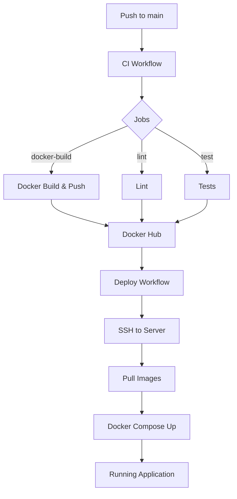
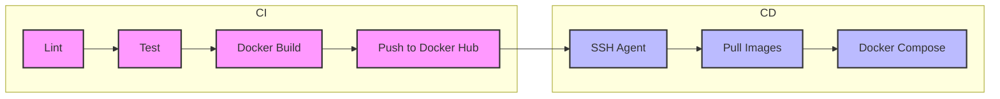

# Detailed CI and Deployment Workflow Description for RefaT

## Table of Contents
1. [Overview](#overview)
2. [CI Workflow (`.github/workflows/ci.yml`)](#ci-workflow)
   - [Trigger Conditions](#ci-trigger)
   - [Jobs](#ci-jobs)
     - [lint](#ci-lint)
     - [test (matrix)](#ci-test)
     - [docker-build](#ci-docker-build)
     - [upload-artifacts](#ci-upload-artifacts)
   - [Secrets & Environment Variables](#ci-secrets)
   - [Caching Strategy](#ci-caching)
3. [Deploy Workflow (`.github/workflows/deploy.yml`)](#deploy-workflow)
   - [Trigger Conditions](#deploy-trigger)
   - [Jobs](#deploy-jobs)
     - [deploy](#deploy-job)
   - [Secrets Required](#deploy-secrets)
   - [SSH Setup Details](#deploy-ssh)
4. [Running the Pipelines Locally](#local-run)
5. [Troubleshooting Tips](#troubleshooting)
6. [Future Enhancements](#future)

---

<a name="overview"></a>
## 1. Overview
The **RefaT** repository uses **GitHub Actions** to provide a full **continuous integration (CI)** and **continuous deployment (CD)** pipeline. The CI workflow validates code quality, runs tests on multiple Node versions, builds Docker images, and pushes these images to Docker Hub. The CD workflow then pulls the newly‑published images onto a remote server via SSH, updates the containers using `docker‑compose`, and restarts the services.

---

<a name="ci-workflow"></a>
## 2. CI Workflow (`.github/workflows/ci.yml`)

<a name="ci-trigger"></a>
### Trigger Conditions
```yaml
on:
  push:
    branches: [ "main" ]
  pull_request:
    branches: [ "main" ]
```
The workflow runs on **every push** and **pull‑request** targeting the `main` branch.

<a name="ci-jobs"></a>
### Jobs
| Job | Description |
|-----|-------------|
| **lint** | Runs `npm run lint` in `backend-nest` to enforce code‑style and static analysis. |
| **test** | Matrix job (`node: ["18.x", "20.x"]`) that installs dependencies, runs backend tests (`npm run test`) and builds the frontend (`npm run build`). |
| **docker-build** | Uses `docker/build-push-action@v4` to build Docker images for the backend and frontend. Images are **pushed** to Docker Hub and tagged with `latest` and `commit-${{ github.sha }}`. |
| **upload-artifacts** | Uploads backend test reports (`test-report.xml`) and the built Next.js `.next` directory as GitHub artifacts for later inspection. |

<a name="ci-lint"></a>
#### lint
```yaml
steps:
  - uses: actions/checkout@v3
  - name: Setup Node
    uses: actions/setup-node@v3
    with:
      node-version: '20.x'
      cache: 'npm'
      cache-dependency-path: backend-nest/package-lock.json
  - name: Install dependencies
    run: npm ci
    working-directory: ./backend-nest
  - name: Run Linter
    run: npm run lint
    working-directory: ./backend-nest
```
The job runs on **ubuntu‑latest** and fails fast on lint errors.

<a name="ci-test"></a>
#### test (matrix)
```yaml
strategy:
  matrix:
    node: ['18.x', '20.x']
steps:
  - uses: actions/checkout@v3
  - name: Setup Node ${{ matrix.node }}
    uses: actions/setup-node@v3
    with:
      node-version: ${{ matrix.node }}
      cache: 'npm'
      cache-dependency-path: backend-nest/package-lock.json
  - name: Install backend deps
    run: npm ci
    working-directory: ./backend-nest
  - name: Run backend tests
    run: npm run test
    working-directory: ./backend-nest
  - name: Setup Frontend Node
    uses: actions/setup-node@v3
    with:
      node-version: '20.x'
      cache: 'npm'
      cache-dependency-path: frontend-next/package-lock.json
  - name: Install frontend deps
    run: npm ci
    working-directory: ./frontend-next
  - name: Build Frontend
    run: npm run build
    working-directory: ./frontend-next
```
Both backend and frontend steps are executed for each Node version.

<a name="ci-docker-build"></a>
#### docker-build
```yaml
steps:
  - uses: actions/checkout@v3
  - name: Set up Docker Buildx
    uses: docker/setup-buildx-action@v2
  - name: Login to Docker Hub
    uses: docker/login-action@v2
    with:
      username: ${{ secrets.DOCKERHUB_USERNAME }}
      password: ${{ secrets.DOCKERHUB_TOKEN }}
  - name: Build Backend Image
    uses: docker/build-push-action@v4
    with:
      context: ./backend-nest
      push: true
      tags: |
        ${{ secrets.DOCKERHUB_USERNAME }}/refa-backend:latest
        ${{ secrets.DOCKERHUB_USERNAME }}/refa-backend:commit-${{ github.sha }}
  - name: Build Frontend Image
    uses: docker/build-push-action@v4
    with:
      context: ./frontend-next
      push: true
      tags: |
        ${{ secrets.DOCKERHUB_USERNAME }}/refa-frontend:latest
        ${{ secrets.DOCKERHUB_USERNAME }}/refa-frontend:commit-${{ github.sha }}
```
Images are published to **Docker Hub** using the secrets defined below.

<a name="ci-upload-artifacts"></a>
#### upload-artifacts
```yaml
steps:
  - name: Upload Backend Test Report
    uses: actions/upload-artifact@v3
    with:
      name: backend-test-report
      path: ./backend-nest/test-report.xml
  - name: Upload Frontend Build
    uses: actions/upload-artifact@v3
    with:
      name: frontend-build
      path: ./frontend-next/.next
```
Artifacts make it easy to download test results from the Actions UI.

<a name="ci-secrets"></a>
### Secrets & Environment Variables
| Secret | Purpose |
|--------|---------|
| `DOCKERHUB_USERNAME` | Docker Hub account name used in image tags. |
| `DOCKERHUB_TOKEN` | Docker Hub personal access token (write permission). |
| `SSH_PRIVATE_KEY` | Private SSH key for the deploy workflow (used only there). |

The CI workflow does **not** require any secret other than Docker Hub credentials.

<a name="ci-caching"></a>
### Caching Strategy
The `actions/setup-node` step caches the `node_modules` folder based on the `package-lock.json` file. This dramatically reduces install time on subsequent runs.

---

<a name="deploy-workflow"></a>
## 3. Deploy Workflow (`.github/workflows/deploy.yml`)

<a name="deploy-trigger"></a>
### Trigger Conditions
```yaml
on:
  workflow_run:
    workflows: ["CI pipeline"]
    types:
      - completed
    branches: ["main"]
    # optional: only run if CI succeeded
    if: ${{ github.event.workflow_run.conclusion == 'success' }}
```
*The workflow runs automatically after a **successful** CI run that pushed Docker images.*

<a name="deploy-jobs"></a>
### Jobs
| Job | Description |
|-----|-------------|
| **deploy** | Checks out the repo, sets up the SSH agent, pulls the newly‑pushed Docker images, and runs `docker‑compose` on the remote server to update containers. |

<a name="deploy-job"></a>
#### deploy
```yaml
steps:
  - uses: actions/checkout@v3
  - name: Set up SSH
    uses: webfactory/ssh-agent@v0.5.4
    with:
      ssh-private-key: ${{ secrets.SSH_PRIVATE_KEY }}
  - name: Deploy via SSH
    run: |
      ssh -o StrictHostKeyChecking=no ${{ secrets.SSH_USER }}@${{ secrets.SSH_HOST }} << 'EOF'
        docker pull ${{ secrets.DOCKERHUB_USERNAME }}/refa-backend:latest
        docker pull ${{ secrets.DOCKERHUB_USERNAME }}/refa-frontend:latest
        docker-compose -f /path/to/docker-compose.yml up -d --remove-orphans
      EOF
```
**Important:** Replace `user@your.server.com` (or use `SSH_USER`/`SSH_HOST` secrets) and `/path/to/docker-compose.yml` with your actual deployment details.

<a name="deploy-secrets"></a>
### Secrets Required
| Secret | Purpose |
|--------|---------|
| `DOCKERHUB_USERNAME` | Docker Hub account for image tags. |
| `DOCKERHUB_TOKEN` | Token with push rights (used by CI, also needed for deploy if it pulls from a private repo). |
| `SSH_PRIVATE_KEY` | Private SSH key that can log into the remote server. |
| `SSH_HOST` *(optional)* | Hostname/IP of the server. |
| `SSH_USER` *(optional)* | SSH username, defaults to `user`. |

<a name="deploy-ssh"></a>
### SSH Setup Details
The workflow employs the **webfactory/ssh-agent** action to load the supplied private key into the SSH agent for the duration of the job. The `StrictHostKeyChecking=no` flag bypasses host‑key verification for first‑time connections (add the host fingerprint to known hosts for production security).

---

<a name="local-run"></a>
## 4. Running the Pipelines Locally
1. **CI** – You can run the same steps locally with Docker Compose or by invoking the same commands (`npm ci`, `npm run lint`, `npm run test`, `docker build`).
2. **Deploy** – To test the deploy script without pushing to GitHub, execute the `ssh` block manually on your workstation, ensuring the target server has Docker and Docker‑Compose installed.

---

<a name="troubleshooting"></a>
## 5. Troubleshooting Tips
| Symptom | Likely Cause | Fix |
|---------|--------------|-----|
| Docker login fails | Wrong `DOCKERHUB_TOKEN` | Regenerate a new token with write access. |
| SSH connection refuses | Wrong private key or missing public key on server | Add the public key to `~/.ssh/authorized_keys` on the server. |
| CI job skips Docker push | `push` flag set to `false` in `docker-build` step | Ensure `push: true` and that required secrets are present. |
| Tests fail on Node 18 but pass on Node 20 | Dependency incompatibility | Pin versions in `package.json` or adjust test configuration. |

---

<a name="future"></a>
## 6. Future Enhancements
- **GitHub Packages** as an alternative container registry.
- **Environment‑specific deployments** (staging vs. production) using GitHub environments and required reviewers.
- **Code‑coverage** reporting via `codecov`.
- **Automated rollback** on deployment failure.
- **Semantic version tagging** of Docker images.

---

# Diagram Overview



## Architecture Diagram



*Generated by Antigravity – your AI coding assistant.*
